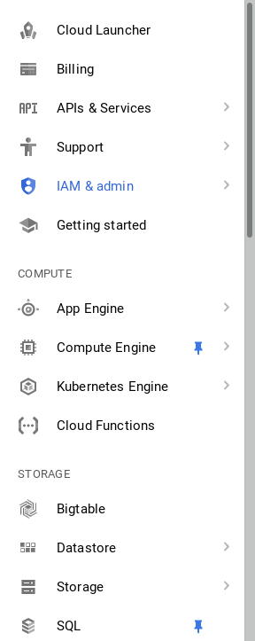
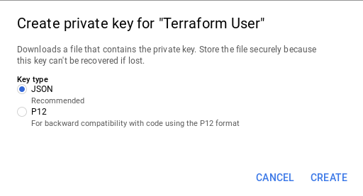

<!-- .slide: data-background="#01b564" -->
## lab ***
# Getting Set up

&&&

## Make a google project
  <style>
  .button {
    background-color: #01b564;
    border: none;
    color: white;
    padding: 15px 32px;
    text-align: center;
    text-decoration: none;
    display: inline-block;
    font-size: 32px;
    width: 100%
} 
.bounding-box {
    text-align: left;
    margin-left: auto !important;
    width: 50%;
    margin-right: auto !important;
    padding: 0 10px;
}
.text-box {
  vertical-align: middle;
width: 100%;
padding: 0;
border: 0;
font-size: 32px;
}
  </style>

<form action="http://$IP$:4567/student" method="post" target="_blank">
<div class="bounding-box">
 <div>
  <label>Email:</label> <input class="text-box" type="email" name="email"><br><small>(must be linked to a valid google account)</small><br>
  </div>
  <input class="button" type="submit" value="Make a Google Project">
</div>
</form> 

&&&
## Install terraform
your distro may have a way to install terraform <!-- .element: class="fragment" --> 

<p class='fragment'> otherwise you can just [download](https://www.terraform.io/downloads.html) the binary </p> 

<pre class='fragment'><code data-trim data-noescape>
  curl https://releases.hashicorp.com/terraform/0.11.2/terraform_0.11.2_linux_amd64.zip | zcat > terraform
  chmod +x terraform
  sudo mv terraform /usr/bin
</pre></code>

Note: 

```
terraform
>~ Usage: terraform
```

&&&
## Set up a project directory

```
mkdir terraform-class
cd terraform-class
```

Note: 

```
pwd
>~ terraform-class
```

&&&
## Create a terraform file

```
touch main.tf
```

Note: 
```
ls
>~ main.tf
```
&&&
## take a look at your newly created project
<a href="https://console.cloud.google.com" target="_blank">console.cloud.google.com</a>
<pre class='fragment'>
project name: 
duncan@fedde.us -> duncan - Terraform Class
</pre>

<pre class='fragment'>
project id: 
duncan@fedde.us -> duncan-terraform-class-x7q
</pre>
<a style="display: none;" href="asstes/x7q.jpg">x7q</a>
&&&

## create a key file for your new project
&&&
<!-- .slide: data-transition="fade-in" -->

&&&
<!-- .slide: data-transition="fade-in" -->

&&&
<!-- .slide: data-transition="fade-in" -->

&&&
<!-- .slide: data-transition="fade-in" -->

&&&
<!-- .slide: data-transition="fade-in slide-out" -->


save as account.json in terrafrom-class dir
&&&
### enable the GCP api
## <a href="https://console.developers.google.com/apis/api/compute.googleapis.com/overview" target="_blank">enable api</a>

&&&
## <a href="http://$IP$:4567/done/***" target="_blank">done</a>
