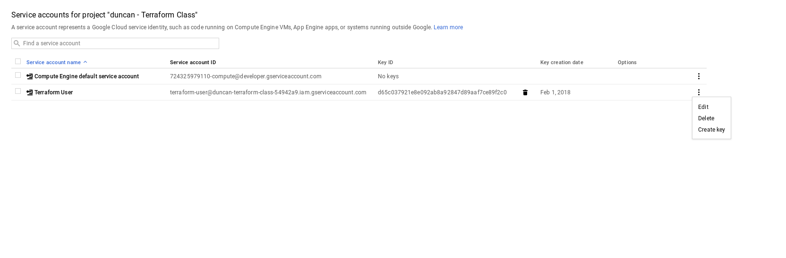

<!-- .slide: data-background="#01b564" -->
## lab 1
# Getting Setup

&&&

## Make a google project

<div style='text-align:center'>
<form action="http://192.168.50.237:4567/student" method="post" target="_blank">
  <label>Email: <br><small>must be linked to a valid google account</small></label><br>
  <input type="email" name="email"><br>
  <input type="submit" value="Make a Google Project">
</form> 
</div>

&&&
## Install terraform
your distro may have a way to install terraform <!-- .element: class="fragment" --> 

<p class='fragment'> otherwise you can just [download](https://www.terraform.io/downloads.html) the binary </p> 

<pre class='fragment'><code data-trim data-noescape>
  curl https://releases.hashicorp.com/terraform/0.11.2/terraform_0.11.2_linux_amd64.zip | zcat > terraform
  chmod +x terraform
  sudo mv terraform /usr/bin
</pre></code>

Note: 

```
terraform
>~ Usage: terraform
```

&&&
## Set up a project directory

```
mkdir terraform-class
cd terraform-class
```

Note: 

```
pwd
>~ terraform-class
```

&&&
## Create a terraform file

```
touch main.tf
```

Note: 
```
ls
>~ main.tf
```
&&&
## take a look at your newly created project
[console.cloud.google.com](https://console.cloud.google.com)
<pre class='fragment'>
project name: 
duncan@fedde.us -> duncan - Terrafrom Class
</pre>

<pre class='fragment'>
project id: 
duncan@fedde.us -> duncan-terrafrom-class-xj7q
</pre>
&&&
## create a key file for your new project
&&&
<!-- .slide: data-transition="slide-in fade-out" -->

&&&
<!-- .slide: data-transition="fade-in" -->

