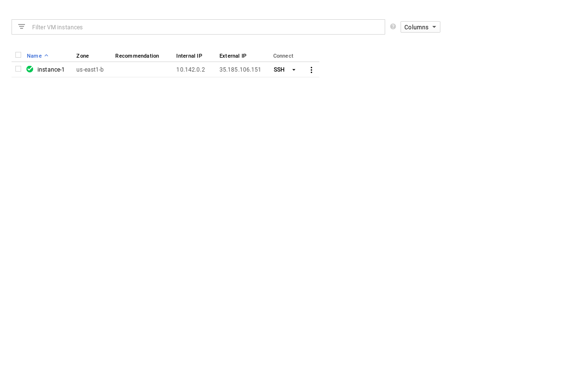

> Terraform is a tool for building, changing, and versioning infrastructure safely and efficiently. Terraform can manage existing and popular service providers as well as custom in-house solutions.
%%%
## But what does that mean

%%%
```hcl
resource "google_compute_instance" "instances" {
  count = "${var.amount}"

  name = "instance-${count.index+1}"
  zone = "${data.google_compute_zones.available.names[count.index % length(data.google_compute_zones.available.names)]}"
  machine_type = "${var.machine_type}"
}
```
%%%

